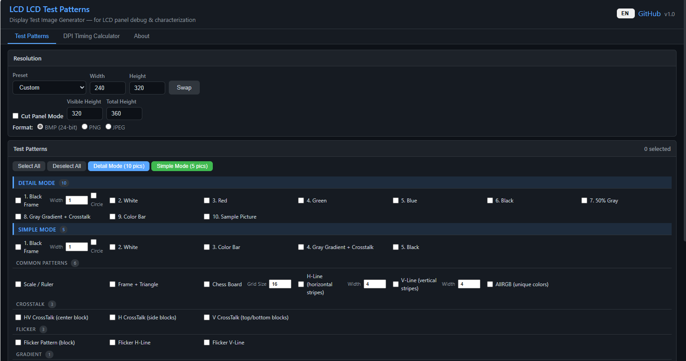
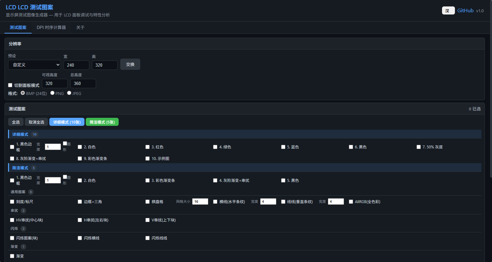
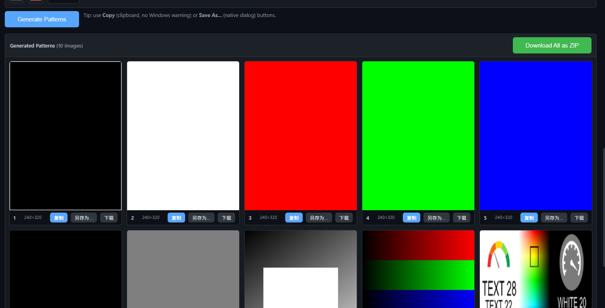
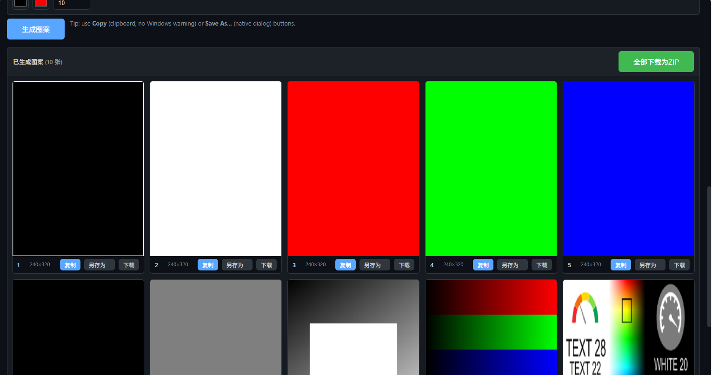

# LCD Test Patterns

[](https://martlet-tech.github.io/lcd-test-patterns/)
[](LICENSE)

**Web-based LCD display test image generator** — a static HTML/JS port of the C# Windows Forms application *TestPictrueGenerator*.

Designed for LCD debug engineers, display driver developers, and hardware validation teams. No server, no build step, no dependencies — open `index.html` in any browser or use the GitHub Pages hosted version.

## Screenshots

| English | Chinese |
|---------|---------|
|  |  |
|  |  |

## Features

### Test Pattern Generation
| Category | Patterns |
|----------|----------|
| **Detail Mode** | Black Frame, White, Red, Green, Blue, Black, 50% Gray, Gray Gradient + Crosstalk, Color Bar, Sample Picture |
| **Simple Mode** | Frame, White, Color Bar, Gray Gradient, Black (5-image subset) |
| **Common** | Scale/Ruler, Frame + Triangle, Chess Board, H-Line/V-Line Stripes, AllRGB |
| **CrossTalk** | HV (center block), Horizontal (side blocks), Vertical (top/bottom blocks) |
| **Flicker** | Block pattern, Horizontal line, Vertical line — configurable colors |
| **Gradient** | 8-direction configurable gradient with custom start/end colors |

### DPI Timing Calculator
- Horizontal/Vertical timing parameter input (HSW, HBP, HACT, HFP, VSW, VBP, VACT, VFP)
- Pixel clock calculation from timing + FPS
- DSI bitrate calculation (lanes × color bits)
- Config script generation with polarity settings

### Output
- PNG / JPEG download
- Batch ZIP download (all selected patterns)
- Full-resolution canvas preview with click-to-zoom
- Cut Panel mode for partial-screen displays

## Usage

### Online
Visit **[https://martlet-tech.github.io/lcd-test-patterns/](https://martlet-tech.github.io/lcd-test-patterns/)**

### Offline
```bash
git clone https://github.com/Martlet-Tech/lcd-test-patterns.git
cd lcd-test-patterns
# Open index.html in your browser
start index.html
```

No build step required — it's a single static HTML file with inline CSS and JavaScript.

## Pattern Description

1. **Black Frame** — White background with a black rectangle (or circle) to check screen boundaries and light bleed
2. **Pure Colors** (White/Red/Green/Blue/Black/Gray) — Detect dead/stuck sub-pixels, check uniformity
3. **Gray Gradient + Crosstalk** — Diagonal gradient with white center rectangle to test gray-level crosstalk
4. **Color Bar** — R/G/B/White/CYM linear gradients for color reproduction assessment
5. **Scale/Ruler** — Crosshair ruler with tick marks at 2/10/50/100 pixel intervals for pixel mapping
6. **Chess Board** — Adjustable grid size for contrast, response time, and moiré evaluation
7. **H-Line / V-Line** — Alternating horizontal/vertical stripes for line defect detection
8. **CrossTalk** — Black rectangles on white background to measure voltage coupling between regions
9. **Flicker** — Alternating color patterns for Vcom/flicker adjustment
10. **AllRGB** — Every pixel gets a unique color (full 24-bit color space distribution)

## Relationship to Original Project

This is a web port of [TestPictrueGenerator](https://gitee.com/martlet/TestPictrueGrenerator) (Gitee), a C# Windows Forms application by Martlet Zhu. The original C# source code is preserved in the `Sources/` directory of that repository.

## Browser Support

Chrome, Firefox, Edge, Safari — any modern browser with Canvas API support.

## Agent Usage (URL Query API)

Construct a URL to auto-configure and generate patterns without manual clicks:

| Param | Example | Description |
|-------|---------|-------------|
| `patterns` | `D01,D02,S01` | Comma-separated pattern IDs to select |
| `fmt` | `bmp` / `png` / `jpeg` | Output image format |
| `res` | `800,480` | Resolution (`,` or `x` separator) |
| `lang` | `en` / `zh` | Interface language |
| `auto` | `1` | Auto-generate on page load |

**Pattern IDs by category:**

| Category | IDs |
|----------|-----|
| Detail Mode (10) | `D01` Black Frame, `D02` White, `D03` Red, `D04` Green, `D05` Blue, `D06` Black, `D07` 50% Gray, `D08` Gray Gradient+Crosstalk, `D09` Color Bar, `D10` Sample Picture |
| Simple Mode (5) | `S01`–`S05` (same as D01–D05 subset) |
| Common (6) | `C01` Scale/Ruler, `C02` Frame+Triangle, `C03` Chess Board, `C04` H-Line, `C05` V-Line, `C06` AllRGB |
| CrossTalk (3) | `X01` HV (center), `X02` H (sides), `X03` V (top/bottom) |
| Flicker (3) | `F01` Block, `F02` H-Line, `F03` V-Line |
| Gradient (1) | `G01` Gradient |

**Examples:**
```
?patterns=D01,D03,D08,C03&fmt=bmp&res=1024,600&auto=1
?patterns=S01,S02,S03,S04,S05&fmt=png&res=800,480&lang=en&auto=1
```

## License

MIT
